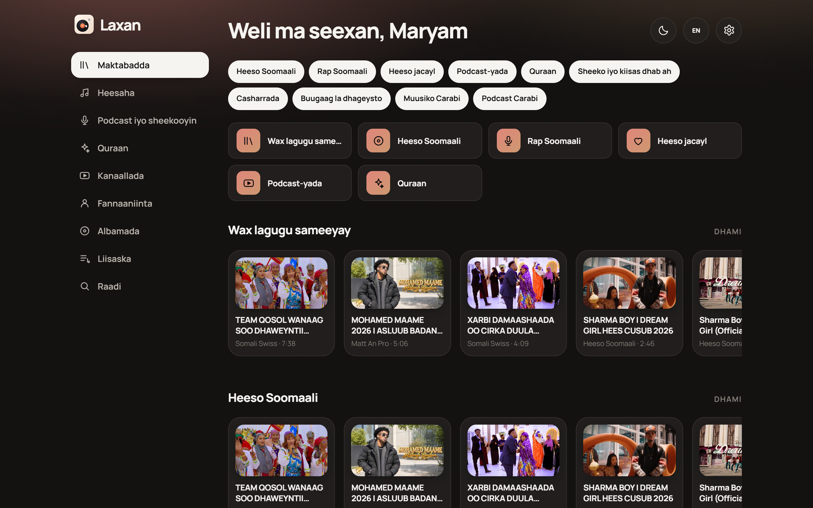
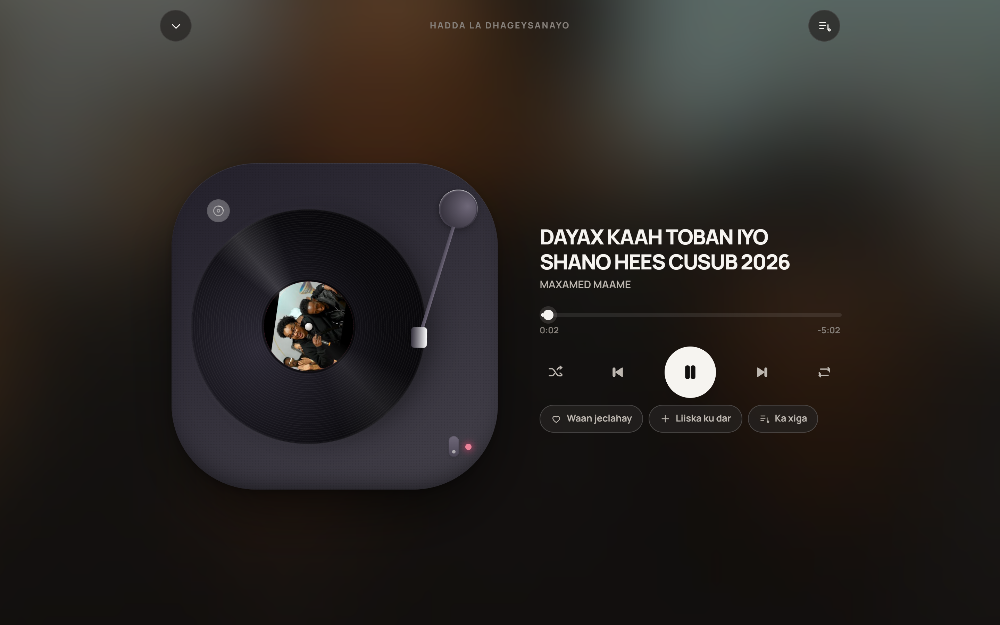
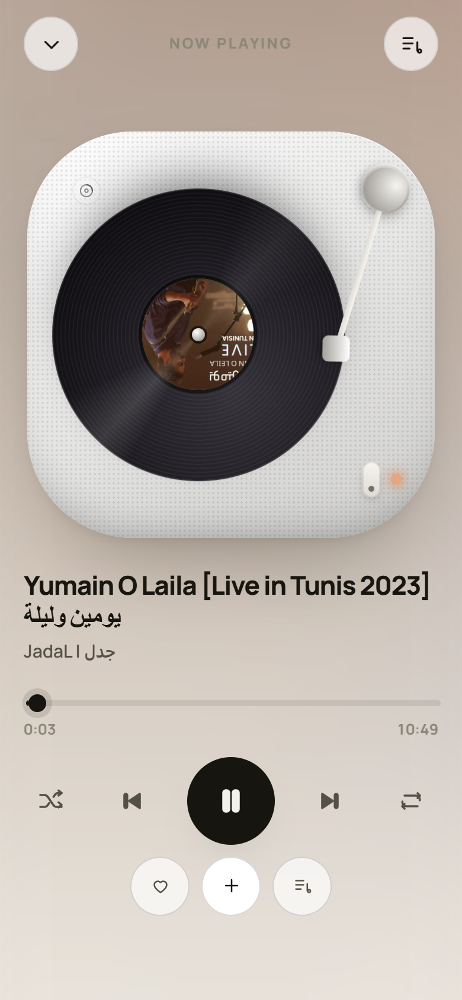
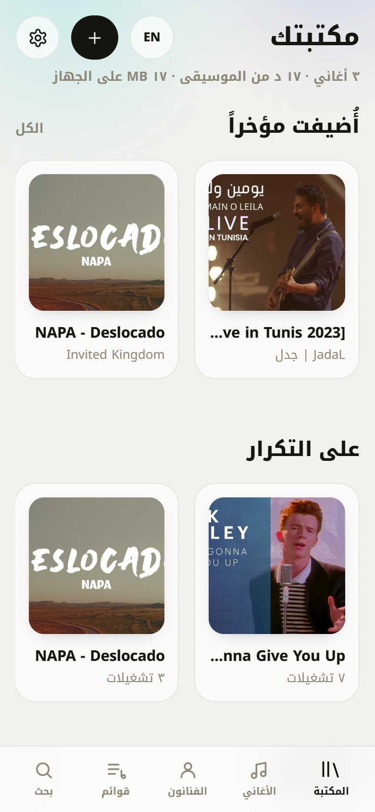

# Lahn · لحن

Your own music library on your own machine. Paste a link, keep the song, play it on the
PC and on the phone over the home Wi-Fi — no subscription, no cloud, nothing uploaded
anywhere.

**Created by Maryam J.**






## What it does

- **Paste a YouTube link** → Lahn downloads the audio, cleans the title of upload noise
  (`Artist - Track (Official Video) [4K Remaster]` → `Track`), grabs the cover art and files
  it under the right artist.
- **Turntable player** — a vinyl deck as the main screen: the platter spins while playing,
  the tonearm drops on the record, and it stops when you pause.
- **Songs, Artists, Albums, Playlists, Search** — plus queue, shuffle, repeat, sleep-free
  plain-file support.
- **Works on the phone** — the server is also the web app, so opening
  `http://<your-pc>:4780` on any device on the LAN gives you the same library. It is a
  installable PWA (Add to Home Screen) with Media Session, so the phone's lock screen gets
  play/pause and track info.
- **English and Arabic** — full RTL layout, Arabic-Indic numerals, one tap to switch.
- **Plain folders are the source of truth** — everything lives as ordinary audio files in
  `library/`; delete the database and rescan and nothing is lost.

## Requirements

- **Node 24+** (uses the built-in `node:sqlite`, so no native database install)
- **yt-dlp** and **ffmpeg**/`ffprobe` on `PATH` — or drop the binaries into
  `server/data/bin/`. `npm run doctor` finds them either way and tells you what is missing.

## Running it

```bash
npm install
npm run dev      # server on :4780 + Vite on :5173, hot reload
```

For everyday use — builds the web app and serves everything from one port:

```bash
npm start        # http://localhost:4780
```

Then, from the phone on the same Wi-Fi, open `http://<your-pc-ip>:4780` and install it to
the home screen. `npm run doctor` prints the address to use.

## Configuration

Everything has a sensible default; set these only if you want to move something.

| Variable        | Default                | Purpose                                  |
| --------------- | ---------------------- | ---------------------------------------- |
| `LAHN_PORT`     | `4780`                 | HTTP port for the app and the API         |
| `LAHN_LIBRARY`  | `./library`            | Where audio files and cover art live      |
| `LAHN_DATA`     | `./server/data`        | SQLite database and local tool binaries   |
| `LAHN_YTDLP`    | auto-detected          | Absolute path to `yt-dlp`                 |
| `LAHN_FFMPEG`   | auto-detected          | Absolute path to `ffmpeg`                 |

## Layout

```
server/src/   Express API, SQLite library, yt-dlp download jobs, Range streaming
web/src/      React 19 app: pages, player state, i18n, hand-written CSS
scripts/      shots.mjs — headless visual regression across desktop/mobile/RTL/dark
library/      your music (gitignored)
server/data/  the database (gitignored)
```

## Development

```bash
npm run doctor                     # check tools, ports, library, database
node scripts/shots.mjs             # 22 screenshots + a real playback assertion
node scripts/poster.mjs            # share/ — posters of the library for social media
```

The shot suite walks every screen in light, dark, mobile and Arabic, and fails loudly if
audio stalls — it is the fastest way to see a regression before it reaches the app.

`poster.mjs` renders the turntable as a printable card in story (1080×1920), square
(1080×1080) and wide (1600×900). Set `POSTER_TITLE` and `POSTER_BY` to rename it:

```bash
POSTER_TITLE="Late Shift" POSTER_BY="curated by Maryam J." node scripts/poster.mjs
```

## Backing it up

Copy `library/`. That folder *is* the collection.

## A note on scope

Downloading from YouTube is against YouTube's Terms of Service. Lahn is a personal tool
for music you can already watch, running only on your own devices on your own network: the
server binds to the LAN, no telemetry, no accounts, nothing leaves the machine. Keep it
that way — it isn't meant to be a public or shared service.
