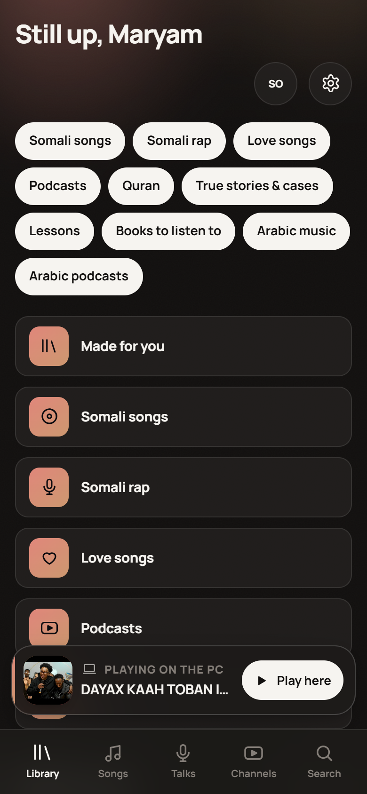

# Laxan

Soomaali music, podcasts, Quran, true stories and lessons — in Somali and Arabic, on your
own machines. Open the app, sign in, choose what you like, and tap anything to play it. No
subscription, no cloud, nothing uploaded anywhere.

**Created by Maryam J.**




## What it does

- **Sign in, then say what you like.** Ten interests — Heeso Soomaali, Rap Soomaali, Heeso
  jacyl, Podcast-yada, Quraan, Sheeko iyo kiisas dhab ah, Casharrada, Buugaag la dhageysto,
  Muusiko Carabi, Podcast Carabi — and the home screen is built from the ones you pick. You
  can change them any time in Settings.
- **Tap to play, nothing saved.** Laxan pulls the audio for that one item, streams it to the
  player with a working scrub bar, and prunes it later. The first play of a track can take
  half a minute; after that it is instant.
- **Save what you want to keep.** The save button is the only thing that writes to your
  library, and it is optional — the shelves work without it.
- **Separate shelves.** Quran is on the Quran page, podcasts on the podcast page, stories on
  the stories page, Arabic music and Arabic podcasts on their own. They never mix.
- **Somali artists.** Twenty curated artists — Hodan Abdirahman, Qamar Suugaani, Abdirashid
  Qaraare, Aar Maanta, Hanad Bandz, Ilkacase, Sharma Boy, Yasin The Don, Amin Yare, Abwaan
  Qorane, K'naan, Hobollada Waaberi, Magool, Axmed Mooge Liibaan, Saado Cali Warsame, Sahra
  Halgan, Abdi Aweys, Xaawo Taabo, Mursal Muuse, Ladan Maria — each with a page of their songs.
- **Search that reaches past the cache.** It looks through everything already fetched and asks
  for more at the same time, so a popular song you have not opened yet still shows up.
- **Turntable player** — a vinyl deck as the now-playing screen: the platter spins, the
  tonearm drops, and it stops when you pause.
- **Works on the phone** — the server is also the web app, so opening
  `http://<your-pc>:4780` on any device on the home Wi-Fi gives you the same library. It is an
  installable PWA with Media Session, so the phone's lock screen gets play/pause and track info.
- **English and Somali** — one tap to switch; the app opens in Somali on a Somali device.
- **Plain folders are still the source of truth** — anything you save lands as an ordinary
  audio file in `library/`; delete the database, rescan, and nothing is lost.

## Requirements

- **Node 24+** (uses the built-in `node:sqlite`, so no native database install)
- **yt-dlp** and **ffmpeg**/`ffprobe` on `PATH` — or drop the binaries into
  `server/data/bin/`. `npm run doctor` finds them either way and tells you what is missing.

## Running it

```bash
npm install
npm run dev      # server on :4780 + Vite on :5173, hot reload
```

For everyday use — builds the web app and serves everything from one port:

```bash
npm start        # http://localhost:4780
```

Then, from the phone on the same Wi-Fi, open `http://<your-pc-ip>:4780` and install it to the
home screen. `npm run doctor` prints the address to use.

## Configuration

Everything has a sensible default; set these only if you want to move something. The `LAHN_`
prefix is the internal one — the app is called Laxan.

| Variable             | Default                | Purpose                                  |
| -------------------- | ---------------------- | ---------------------------------------- |
| `LAHN_PORT`          | `4780`                 | HTTP port for the app and the API        |
| `LAHN_LIBRARY`       | `./library`            | Where saved audio and cover art live     |
| `LAHN_DATA`          | `./server/data`        | SQLite database, streamed audio, tools   |
| `LAHN_YTDLP`         | auto-detected          | Absolute path to `yt-dlp`                |
| `LAHN_FFMPEG`        | auto-detected          | Absolute path to `ffmpeg`                |
| `LAHN_LICENSED_ONLY` | off                    | Hide every scraped source — see below    |

## Layout

```
server/src/   Express API, accounts, SQLite library, shelf catalog, streaming
web/src/      React 19 app: pages, player state, i18n, hand-written CSS
scripts/      the verification and screenshot suite below
library/      your saved music (gitignored)
server/data/  the database and the streaming cache (gitignored)
```

## The two halves of the catalog

Every source on the Channels page declares a **driver**, and the driver decides how the audio
arrives:

- `youtube` — a channel or a saved search, scraped with yt-dlp and converted with ffmpeg. This
  is the half with the music: Heeso, Rap, Heeso jacyl, Muusiko Carabi, and the twenty artists.
  It needs yt-dlp, it can take half a minute before the first play, and it is the half that is
  against YouTube's terms once anyone but you is listening.
- `rss` and `quran` — a podcast feed, or a recitation server. These publish a direct link to
  the mp3 themselves, so Laxan just forwards the bytes (with real Range seeking) and never
  touches the converter. Tap-to-sound is under two seconds.

Set `LAHN_LICENSED_ONLY=1` and the second half is all the app shows: the scraped sources
disappear from the shelves, the catalog, search and the refresh cycle, and the Quran, podcast,
story, book, lesson and Arabic-podcast shelves stay — 438 items across six shelves on a fresh
install. That is the build to hand to someone else, wrap as an APK, or put on a store.

What it does **not** have is music. Somali and Arabic pop is not licensed anywhere that allows
redistribution — archive.org's Creative Commons collections carry zero Somali songs, and the
"Somali Songs" tags there are an uploader claiming rights to other people's work. Heeso only
arrives through your own library folder or the scraped shelves, which is exactly why the
publishable build leaves them out.

```bash
node scripts/licensed.mjs   # boots a licensed-only copy on :4791, plays one item per shelf, deletes itself
```

## Development

```bash
npm run doctor                        # tools, ports, library, database
node scripts/check.mjs                # sign in, wait for the catalog, play one item per shelf
node scripts/streamtest.mjs           # every shelf, one item each, with the failure reason
node scripts/catalogcheck.mjs         # search, the artist grid, one artist page
node scripts/licensed.mjs             # the publishable half, on its own port, played end to end
node scripts/preview.mjs              # 11 screenshots of the real app, desktop + phone
node scripts/users.mjs                # list accounts, clean up test ones
node scripts/shots.mjs                # the older full-screen walk with a playback assertion
node scripts/poster.mjs               # share/ — cards of the library for social media
```

`check.mjs` and `preview.mjs` sign up a throwaway account, use it, and delete it again — the
users table is the door to the whole app, so a leftover test account would lock you out.

## Backing it up

Copy `library/` and `server/data/lahn.db`. The first is the music you kept, the second is your
accounts, saves and playlists.

## A note on scope

Fetching audio from YouTube is against YouTube's Terms of Service. Laxan is a personal tool
for things you can already watch, running only on your own devices on your own network: the
server binds to the LAN, there is no telemetry, and nothing leaves the machine. Keep it that
way — it is not meant to be a public or shared service, and it is not a store of other
people's work.

The licensed half described above is the exception: those feeds and recitation servers publish
their files for anyone to play, so a `LAHN_LICENSED_ONLY=1` build of Laxan is one you can put
in front of other people. The scraped half is not, and turning it on for strangers — a hosted
URL, a store listing — is how your name ends up on someone else's copyright claim.
